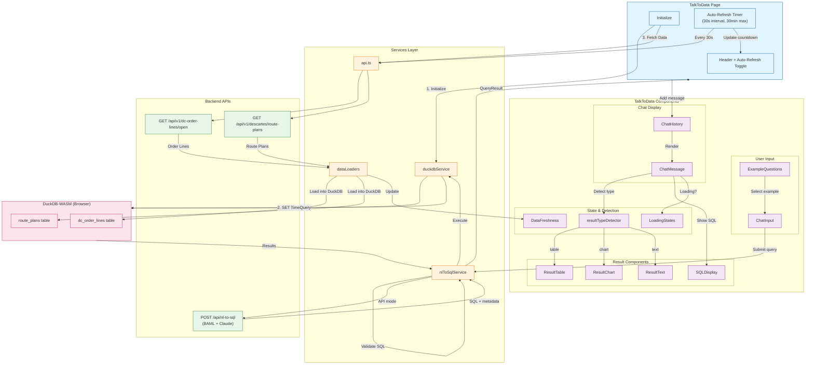
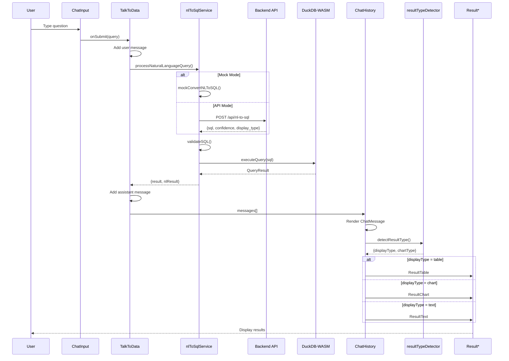
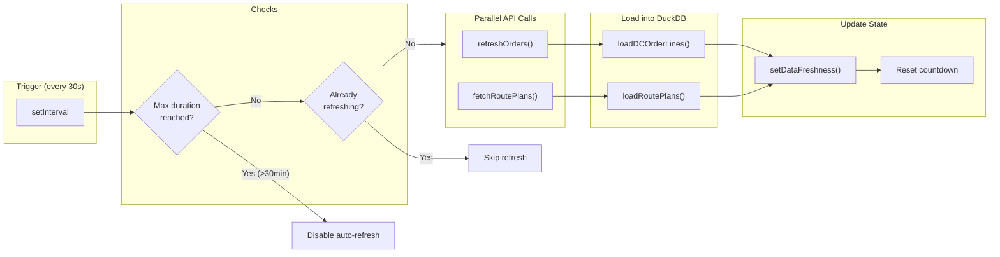
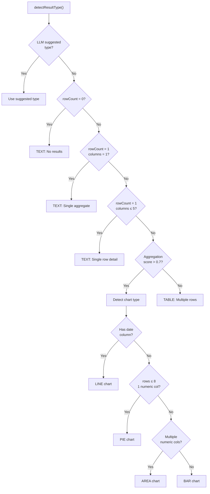

# DC Dashboard

A React-based dashboard for Distribution Center operations with AI-powered natural language data querying.

## Features

- **Orders Dashboard**: View and manage DC order lines
- **Talk to Data**: AI-powered natural language querying using DuckDB-WASM
- **Route Planning**: Descartes route plan integration
- **Exceptions Tracking**: Traction and ship set exceptions

---

## Talk to Data Architecture

The "Talk to Data" feature allows users to query dashboard data using natural language. The system converts questions to SQL, executes them in-browser using DuckDB-WASM, and presents results as tables, charts, or text.

### Component Architecture



### Query Flow Sequence



### Auto-Refresh Flow



### Result Type Detection Logic



### File Structure

```
src/components/TalkToData/
├── index.ts                 # Exports all components
├── TalkToData.css          # All component styles
│
├── ChatInput.tsx           # User query input + submit
├── ChatHistory.tsx         # Message list container
├── ChatMessage.tsx         # Individual message + result
│
├── ResultTable.tsx         # Table display (Ant Design)
├── ResultChart.tsx         # Chart display (Recharts)
├── ResultText.tsx          # Text/summary display
├── SQLDisplay.tsx          # SQL with syntax highlighting
│
├── ExampleQuestions.tsx    # Clickable example queries
├── DataFreshness.tsx       # Data load status indicator
├── LoadingStates.tsx       # Spinners, skeletons
└── resultTypeDetector.ts   # Auto-detect display type
```

### Environment Configuration

```env
# Frontend (.env)
VITE_USE_MOCK_NL_TO_SQL=false          # true for mock mode, false for API
VITE_LLM_API_URL=http://localhost:8001  # LLM backend
VITE_API_BASE_URL=http://localhost:8000 # Data API
```

---

## Getting Started

### Prerequisites

- Node.js 18+
- npm or yarn

### Installation

```bash
npm install
```

### Development

```bash
npm run dev
```

### Build

```bash
npm run build
```

---

## Tech Stack

- **Frontend**: React 18, TypeScript, Vite
- **UI Library**: Ant Design
- **Charts**: Recharts
- **In-Browser Database**: DuckDB-WASM
- **LLM Integration**: BAML + Claude (backend)
- **State Management**: React Context

---

## Original Vite Template Info

Currently, two official plugins are available:

- [@vitejs/plugin-react](https://github.com/vitejs/vite-plugin-react/blob/main/packages/plugin-react) uses [Babel](https://babeljs.io/) (or [oxc](https://oxc.rs) when used in [rolldown-vite](https://vite.dev/guide/rolldown)) for Fast Refresh
- [@vitejs/plugin-react-swc](https://github.com/vitejs/vite-plugin-react/blob/main/packages/plugin-react-swc) uses [SWC](https://swc.rs/) for Fast Refresh

## React Compiler

The React Compiler is not enabled on this template because of its impact on dev & build performances. To add it, see [this documentation](https://react.dev/learn/react-compiler/installation).

## Expanding the ESLint configuration

If you are developing a production application, we recommend updating the configuration to enable type-aware lint rules:

```js
export default defineConfig([
  globalIgnores(['dist']),
  {
    files: ['**/*.{ts,tsx}'],
    extends: [
      // Other configs...

      // Remove tseslint.configs.recommended and replace with this
      tseslint.configs.recommendedTypeChecked,
      // Alternatively, use this for stricter rules
      tseslint.configs.strictTypeChecked,
      // Optionally, add this for stylistic rules
      tseslint.configs.stylisticTypeChecked,

      // Other configs...
    ],
    languageOptions: {
      parserOptions: {
        project: ['./tsconfig.node.json', './tsconfig.app.json'],
        tsconfigRootDir: import.meta.dirname,
      },
      // other options...
    },
  },
])
```

You can also install [eslint-plugin-react-x](https://github.com/Rel1cx/eslint-react/tree/main/packages/plugins/eslint-plugin-react-x) and [eslint-plugin-react-dom](https://github.com/Rel1cx/eslint-react/tree/main/packages/plugins/eslint-plugin-react-dom) for React-specific lint rules:

```js
// eslint.config.js
import reactX from 'eslint-plugin-react-x'
import reactDom from 'eslint-plugin-react-dom'

export default defineConfig([
  globalIgnores(['dist']),
  {
    files: ['**/*.{ts,tsx}'],
    extends: [
      // Other configs...
      // Enable lint rules for React
      reactX.configs['recommended-typescript'],
      // Enable lint rules for React DOM
      reactDom.configs.recommended,
    ],
    languageOptions: {
      parserOptions: {
        project: ['./tsconfig.node.json', './tsconfig.app.json'],
        tsconfigRootDir: import.meta.dirname,
      },
      // other options...
    },
  },
])
```
